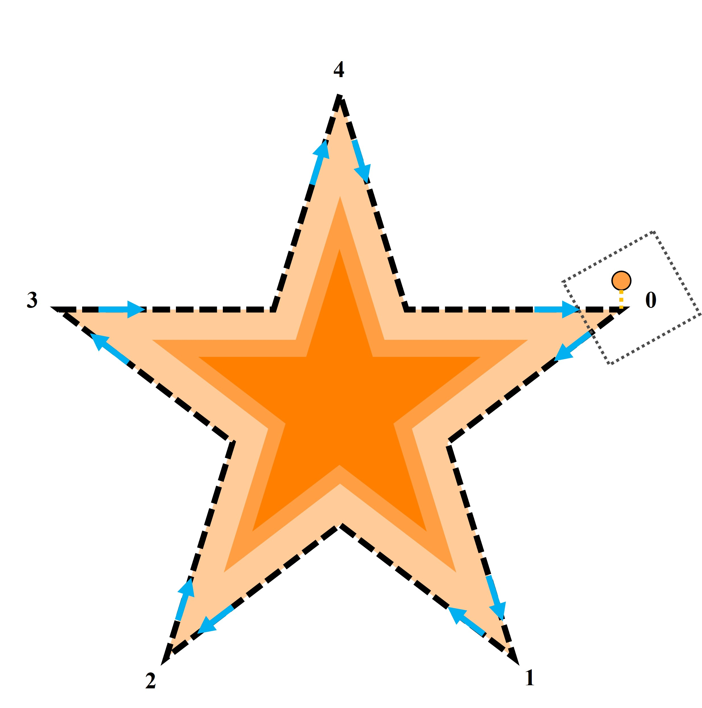

# Vertex Pursuit dataset for Soft and Hard Data Fusion and Skill Assessment

A unique soft-hard dataset combining quantitative motor performance metrics with qualitative human evaluations from the Vertex Pursuit task. Features trajectory data, timing metrics, and natural language assessments from 24 participants across 600 trials. Ideal for multimodal ML research bridging human movement analysis and NLP.

## Overview

The Vertex Pursuit dataset is a comprehensive collection of human motor skill performance data from a gamified assessment platform. This dataset uniquely combines:
- **Hard data**: Precise trajectory measurements, timing, and event markers
- **Soft data**: Natural language evaluations from trained human assessors

The dataset was collected as part of research published in:
> Iranfar, A., Soleymannejad, M., Moshiri, B., & Taghirad, H. D. (2025). Natural Language Processing and soft data for motor skill assessment: A case study in surgical training simulations. *Computer Methods and Programs in Biomedicine*, 264, 108686.

## Key Features

- 🎮 **Gamified Task**: Star pentagon tracing with dual-task paradigm
- 👥 **24 Participants**: Diverse demographics (age, gender, dominant hand)
- 📊 **600 Sub-trials**: 5 trials per participant, each divided into 5 sub-trials
- 🖱️ **High-Precision Tracking**: Mouse coordinates sampled every 200ms
- 💬 **Expert Evaluations**: Structured natural language feedback for each sub-trial
- 🏷️ **Ground Truth Labels**: Consensus-based skill level classifications

## Participant Demographics

| Characteristic | Group | Count |
|----------------|-------|-------|
| Age | Under 20 years | 1 |
|     | 20 to 40 years | 17 |
|     | Over 40 years | 6 |
| Gender | Male | 12 |
|        | Female | 12 |
| Dominant Hand | Right | 18 |
|               | Left | 6 |

## Experiment Setup


*The Vertex Pursuit experiment interface showing the star pentagon tracing task with secondary spacebar task requirements.*

## Dataset Structure

```
data/
├── raw/
│ ├── trajectories/ # Individual participant trajectory files
│ │ ├── SHSA_1_1.csv # Format: SHSA_[participant]_[trial].csv
│ │ └── ...
│ └── evaluations/
│ └── softData-v02.csv # Human evaluator assessments
└── processed/
 └── master_dataset.csv # Combined dataset with features
```

## Quick Start

```python
import pandas as pd

# Load the master dataset
df = pd.read_csv('data/processed/master_dataset.csv')

# Access trajectory data for a specific sub-trial
df['Subtrial'] = df['Subtrial'].apply(eval) # Convert string to dict
trajectory = df.iloc[0]['Subtrial'] # First sub-trial

# Access evaluator text and labels
text = df.iloc[0]['text']
label = df.iloc[0]['label']
```

## Documentation

- [Data Format Guide](docs/data_format.md) - Detailed description of all data files and fields
- [Experiment Protocol](docs/experiment_protocol.md) - Complete experimental setup and procedures

## Citation

If you use this dataset in your research, please cite:

```bibtex
@article{iranfar2025natural,
 title={Natural Language Processing and soft data for motor skill assessment: A case study in surgical training simulations},
 author={Iranfar, Arash and Soleymannejad, Mohammad and Moshiri, Behzad and Taghirad, Hamid D},
 journal={Computer Methods and Programs in Biomedicine},
 volume={264},
 pages={108686},
 year={2025},
 publisher={Elsevier}
}
```

## License

This dataset is released under the [MIT License](LICENSE).

## Contributors

- [Arash Iranfar](https://github.com/ArashIranfar)
- [Mohammad Soleymannejad](https://github.com/muhammadsn)
- [Elahe Radmanesh](https://github.com/erade)

## Contact

For questions or issues, please open an issue on this repository or contact me at: arash.iranfar@gmail.com
